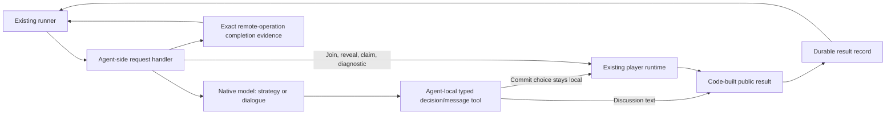

# Deterministic agent operations and JSON

Date: October 6, 2026.

Status: proposed; implementation has not started. This document was explicitly
requested by the user. It proposes a focused correction to the conference
implementation and retains the approved V2 decisions and hard limits.

## Outcome

The models make their own strategic choices and write their own dialogue.
Agent-side code constructs every protocol response, executes mechanical
operations, records their results, and reports completion. The coordinator
consumes these records directly. A model's final chat answer is never the
authoritative source of request identity, transaction outcome, or tool JSON.

JSON remains the application protocol. Its serialization belongs to code.
This removes formatting failures from the handoff; it does not guarantee model
participation, network availability, transaction success, or a game without
defaults.

## Evidence and existing components

- [player-cli.mjs](../integration/conference-runner/src/maritime/player-cli.mjs)
  already serializes runtime results with `JSON.stringify`.
- [player-runtime.mjs](../integration/conference-runner/src/maritime/player-runtime.mjs)
  already constructs response identity, locks the seat, preserves commit bundles,
  and saves successful transaction responses before returning them.
- [transport.mjs](../integration/conference-runner/src/maritime/transport.mjs)
  currently instructs the model to run a shell command and return its exact JSON.
  The coordinator parses the final `/chat` response for gameplay, discussion,
  and non-signing diagnostics.
- [reconcile.mjs](../integration/conference-runner/src/maritime/reconcile.mjs)
  already reads an exact completed player journal and verifies canonical receipts
  for join, commit, and reveal. This is currently a recovery path after a bad
  or lost chat reply; claims are not supported by this reader.
- Game 25 demonstrated an all-acted cancellation race, fixed in `d75edbd`.
  During Game 26, hs-4's join and hs-5's round-1 reveal failed chat JSON
  validation, then reached the action allowance during recovery. These are
  observed handoff failures. The records do not establish why the models
  produced invalid final text.

Reuse the current runner, player CLI, private journals, execution permits,
Maritime adapter, quarantine, and Telegram delivery. This is one implementation
batch, not a new orchestration platform or a broad audit.

## Division of responsibility

| Operation | Model responsibility | Code responsibility |
|---|---|---|
| Join | None | Dispatch the installed player handler, use its configured wallet/cause, sign once, save the result. |
| Discussion | Write the substantive team message. | Bind the message to the staged request, validate it, and construct the discussion JSON. |
| Commit | Select Share, Steal, or Catch through an agent-local typed tool. | Bind the choice to the staged request, preserve it privately, create the bundle, sign once, and save the public receipt. |
| Reveal | None | Reveal the existing private bundle without selecting another move. |
| Claim/refund | None | Check canonical settlement, invoke the existing player claim/refund operation, and save its result. |
| Diagnostic | Make a decision only when the diagnostic explicitly tests model decision input. | Run deterministic checks and serialize their results directly. |
| Phase scheduling | None | Use the existing on-chain predicates and deadlines. |
| Completion and recovery | None | Track the exact operation and remote work, read saved results, and verify chain evidence. |

Each agent retains its own signing key and private choices. The coordinator
dispatches requests and reads public results; it never receives an unrevealed
choice or selects a fallback move.

## Target handoff

The model may return prose after a tool completes. That prose does not replace,
invalidate, or acknowledge the tool result. A saved tool result also does not
prove that the enclosing native model turn has finished.

## Implementation sequence

### 0. Confirm the two native integration points

Before changing gameplay, verify narrowly against the installed OpenClaw and
Hermes versions:

1. How to register or wrap an agent-local typed tool whose handler can access the
   staged request and existing player runtime without exposing private arguments
   to the coordinator.
2. How to obtain completion for the exact native turn or exec operation, including
   whether the current API exposes an operation identifier, final exit status,
   or an existing native completion hook.

Use local fixtures first. Any live capability check is non-signing, counted under
the existing wake cap, and returns the seat to confirmed sleep. Do not assume
that `/exec` has the native harness user's environment, permissions, or private
wallet access. Hermes must retain its supported UID/GID and encrypted credential
handling; OpenClaw must retain its installed runtime identity.

Acceptance: one concrete supported invocation and completion contract per
harness. If a required native hook is unavailable, report the exact missing
capability. Do not silently fall back to parsing model-generated protocol JSON.

### 1. Make a durable tool result the primary response

Extend the existing private player journal and response validation rather than
creating a second transaction ledger.

- Native code binds request ID, seat, game, round, phase, operation and request
  digest from the validated staged request. Models do not supply these fields.
- Preserve the existing semantic action identity that prevents a second signing
  operation for the same seat/game/round/action. Bind each dispatch attempt to
  that identity separately. Reusing an earlier action result must retain its
  original execution identity; it must not claim that a new remote job completed.
- Persist a complete, validated result atomically before acknowledging it. Cover
  successful submissions, observed discussion, skipped operations, definite
  unsent failures, and uncertain submissions. Preserve the original request and
  result digests for readback validation.
- Provide one narrow read-only result/status operation. Export only allowlisted
  public response fields and fixed error/state codes. Never copy an entire
  private journal, commit choice, salt, bundle, environment, or native transcript.
- Include explicit operation-completion evidence separately from the public
  transaction response. An existing journal `done` means the player tool saved
  its result; it does not mean an enclosing chat job ended.
- Use the existing response schema where sufficient. Version any changed
  persisted metadata explicitly, with compatibility for historical journals and
  proof reports. Preserve unknown operations during migration.

Likely files: `player-runtime.mjs`, `player-cli.mjs`, `protocol.mjs`,
`reconcile.mjs`, and their existing tests.

Acceptance: the coordinator receives the same validated public tool result
whether the model's final answer is valid JSON, prose, malformed, empty, or lost.
Re-reading the result performs no signing operation.

### 2. Execute mechanical actions without a model round trip

Route join, reveal, claim/refund, and deterministic diagnostics through an
agent-side handler that invokes the installed player runtime directly.

- Reuse capacity admission, wake confirmation, runtime/model-route checks,
  execution permits, phase checks, private seat locking, and wallet isolation.
- Construct stdin/arguments in code from the immutable staged request. Remove
  model-generated shell commands and request copying from these operations.
- Run with the verified agent runtime identity and required private environment.
  Keep credentials within the agent; never send them in argv, result payloads,
  coordinator requests, or logs.
- Read the handler's deterministic result or its saved result record directly.
  Do not parse an assistant answer for transaction success.
- Keep action time starting after capacity admission. Derive exec/read bounds
  from the remaining action and authoritative phase allowance. Confirm the API's
  supported execution limits in step 0; do not introduce a short exec timeout
  that cuts off a healthy signing operation.
- Diagnostics that run code directly prove those checks. Any diagnostic claiming
  actual model inference still needs a real native model call and the applicable
  provenance evidence. Preserve V2 D3's configuration-level disclosure.

Likely files: `transport.mjs`, `player-cli.mjs`, installation/identity helpers,
diagnostic adapters, and controlled-proof wrappers.

Acceptance: join/reveal/claim/refund and mechanical diagnostics use zero model
calls. Reveals reuse the stored bundle; duplicate dispatches do not create a
second transaction. Wrong identity, missing permits, and stale phases prevent
submission.

### 3. Give decisions and dialogue a small native tool interface

Keep real native OpenClaw/Hermes model calls for strategic choices and discussion.
Install a request-bound tool interface in each harness:

- Commit tool: the model supplies only the enum `share`, `steal`, or `catch`.
  The handler gets identity and immutable request data from the staged request,
  validates phase/permit, and calls the existing player runtime locally. Choice
  arguments and bundles remain private to that agent.
- Discussion tool: the model supplies its message text. Code validates the text,
  attaches request identity, serializes the existing discussion envelope, and
  saves it as an observed result. Discussion authorizes no signing operation.
- The handler accepts one valid decision/message for the request. Reject unknown
  tools, extra identity fields, invalid enums, and conflicting second decisions
  before side effects. A repeated accepted tool call reads the existing result.
- Remove `YOUR_CHOICE` shell substitution and instructions to copy protocol JSON
  into the final answer. Update installed instructions and prompt builders together.
- Keep “succinct in ASD-STE100 format” as dialogue guidance, without a character
  limit. Retain necessary serialized byte/HTTP bounds. Preserve complete accepted
  text and the existing labeled Telegram splitting.
- If a model finishes without invoking the required tool, report a fixed missing
  decision/message failure. Allow at most one corrective turn only when the prior
  turn ended, no result was accepted, no submission is uncertain, and the phase
  allowance remains. Never derive a move from prose or choose one in code.
- Once a valid result exists, later model prose cannot overwrite it. A live or
  uncertain native turn still occupies its capacity reservation.

Likely files: `recipes.mjs`, `install.mjs`, `transport.mjs`, `protocol.mjs`,
and the smallest harness-specific registration adapter required by step 0.

Acceptance: the model supplies only decision/message content. Native code owns
all envelope fields and serialization. Malformed final prose causes no protocol
failure after a valid tool result; failure to decide remains a genuine model
failure with no coordinator-selected move.

### 4. Separate result, transaction and job completion

Keep these independent facts in the existing dispatch record:

| Fact | Sufficient evidence | Does not establish |
|---|---|---|
| Tool result available | Exact durable result with matching request/action identity and digest. | Chain confirmation or native-turn completion. |
| Transaction confirmed | Canonical receipt/event for the expected chain, contract, wallet, game, round and operation. | Remote job completion. |
| Remote work completed | Exact operation's final response/exit, or verified native completion evidence with no pending owned work. | Successful transaction. |
| Safe capacity release | Known-ended remote work and a later matching inactive/sleeping read. | A different operation's completion. |

- Carry the exact operation identity and these states through the existing
  transport, runner, proof wrappers, and quarantine. Do not add a parallel
  scheduler or rely on free-form chat acknowledgements.
- A local result can be accepted while an enclosing native turn is still running;
  keep the seat reserved and send no further operation to it until completion is
  resolved. Do not advance a phase in a way that cancels a pending return merely
  because all transactions landed; retain `d75edbd`'s bounded draining behavior.
- Use the existing separate finite cleanup allowance after known-ended work.
  A result read or native inspection that remains in flight counts as uncertain
  work too. Timeout means unknown, rather than completed or safe to retry.
- If the service lacks exact completion evidence, retain conservative quarantine
  until the job is explicitly ended and a later read confirms inactivity. Saved
  transaction JSON must never bypass that requirement.

Acceptance: delayed replies, a lost HTTP response, or a stale sleep snapshot
cannot free a still-running seat. Restarted coordinators preserve reservations
and reconcile the exact original operation before sending another request.

### 5. Make recovery a normal read-only operation

- Use saved tool results as the ordinary response source, rather than waiting
  for chat JSON validation to fail before reading them.
- On a lost transport response, query the same operation/result record within a
  bounded allowance. Verify its request binding and transaction's canonical
  receipt/event where relevant. Retain the first failure and recovery outcome in
  the existing compact diagnostic record.
- Extend the existing recovery verifier to claims/refunds with the actual
  canonical settlement events and payout semantics. Discussion/diagnostic
  results need their identity/content validation, not an invented chain receipt.
- Preserve definite-unsent, submitted/confirmed, and outcome-unknown states.
  Never infer unsent solely from an absent result file or resend an uncertain
  mutation. An incomplete journal remains evidence of uncertainty.
- Support crashes after transaction submission, after result persistence, and
  before acknowledgement. Recovery must not rerun signing, reselect a choice,
  regenerate a reveal bundle, or invent an agent message.

Acceptance: a missing chat answer cannot hide a completed action. A confirmed
action with unfinished remote work is recorded accurately and remains reserved.

### 6. Test, deploy once, and verify live

Use targeted tests for each changed component and integration checks at assembly.
Include these regression cases:

1. Valid tool result followed by prose, malformed JSON, empty final output, and
   a lost final chat response: identical accepted protocol result.
2. Mechanical join/reveal/claim/refund: no model call, exactly one authorized
   signing call, correct agent runtime identity and permit checks.
3. Invalid or absent model choice: no signing and no fabricated move. Conflicting
   second choice and duplicate tool calls cannot change an accepted commitment.
4. Wrong request/seat/game/round/operation, changed request digest, partial result
   write, or unsafe result path: reject without exposing private material.
5. Crash after broadcast and after durable result write: read-only reconciliation,
   no signing replay, original operation identity retained.
6. Chain confirmation before native-turn completion: keep capacity reserved.
   Final completion plus later sleep: release once. A stale sleeping snapshot or
   pending inspection cannot release capacity.
7. Queue waits, actual phase expiry, delayed all-acted replies, and separate
   cleanup allowance: retain the existing timing and cancellation protections.
8. Model-generated dialogue: code-built JSON, full accepted text, correct team
   isolation, secret rejection, and labeled Telegram splitting.
9. Both harnesses and both debug/proof paths: equivalent result semantics,
   unchanged proof admission and provenance requirements, persistent quarantine.

Batch agent-side changes and reinstall all ten seats once after local integration
passes. Do not deploy while Game 26 or another game is active. Preserve private
state, historical journals, old reports and consumed creation fuses.

Run non-signing checks on one Hermes and one OpenClaw seat through the new
interfaces, then one fresh 5v5 debug game under the existing authorization and
cleanup rules. Keep current timing for this verification. Record actual model
calls, JSON relay failures, defaults, and existing queue/action/cleanup timings
in `conference/STATUS.md`; no extra logging stream is needed.

The user requested this plan, not its implementation. Begin this batch only when
the user instructs implementation. Creating this file authorizes no new live
game. Finish cleanup of already-authorized Game 26 under the existing rules.

## Completion criteria and V2 continuation

- Every application envelope and mechanical result is constructed by code.
- No gameplay, discussion, or diagnostic success depends on copying JSON from
  a model's final answer.
- Mechanical operations make no model calls. Strategy/dialogue still come from
  the assigned agent using the authorized native model route.
- Lost or malformed final text after a valid tool result causes no additional
  signing operation, false unsent classification, or unsafe capacity release.
- A live 5v5 verifies the new handoff, Telegram results, and terminal cleanup.
  Count defaults honestly; a degraded game never passes proof.
- Resume remaining V2 step 6: required full suite, owed claims including Game 20,
  fresh proof diagnostics/continuity, normal proof run, existing `proof-audit`,
  and user review. Retain D3's disclosure when applicable.

Model changes, shorter clocks, continuous operation, broader logging, hosting,
UI expansion and unrelated deferred `fix_issue.MD` findings remain outside this
batch.
